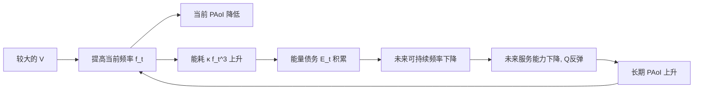

# Lyapunov优化中惩罚项与漂移项相关时的短视陷阱

**执行摘要**

经典 drift-plus-penalty（DPP）对“时均目标 + 时均约束”问题给出 \(O(1/V)\) 最优性差距与 \(O(V)\) 积压权衡；但这并不自动覆盖“惩罚项本身由队列/能量状态内生生成，且当前动作可立刻买到更低惩罚、同时透支未来资源”的设定。citeturn2view0turn2view2  
真正危险的不是“\(p\) 与 \(Q\) 相关”，而是沿资源透支方向 \(d\) 存在 \(D_d p(x,u)<0\)：当前加大动作会立刻降低罚项，但会增加未来资源赤字。  
在可持续边界 \(u_s(x)\) 上，若 drift-only 目标的边际导数 \(D_d\psi(x,u_s)\ge 0\)，则存在状态依赖阈值
\[
V_{\rm crit}(x;d)=\frac{D_d\psi(x,u_s)}{-D_dp(x,u_s)},
\]
当 \(V>V_{\rm crit}\) 时，DPP 会越过可持续边界，形成“今天更好、明天更差”的循环。  
对 PAoI 模型 \(p=\alpha Q/f,\; c(f)=\kappa f^3\)，阈值可写成
\[
V_{\rm crit}(Q,E)=\frac{f_s^2(3\kappa E f_s^2-Q)}{\alpha Q},
\]
说明大队列、小能量余量、强即时权重会显著放大短视风险。  
规避方法不应只靠“调小 \(V\)”，更有效的是：把时均目标重写为 Lyapunov 可处理形式；令 \(V\) 状态依赖；对动作集加入可持续性约束，或用预测/有限时域滚动优化补上未来机会成本。citeturn21view0turn17view0turn13view0turn34view0  
现有文献已分别处理 delay、AoI、energy harvesting、finite-capacity、forecast-enhanced 等特例，但尚缺少一个统一的“安全判据 + 临界 \(V\) + 全局非单调性”理论。citeturn2view2turn21view0turn27view0turn34view0turn13view0

## 核心机制与入门例子

**通俗解释。** 可以把 DPP 想成“司机边开车边看两个仪表”：一个是“队列/债务是否会失控”，一个是“当前时延或信息新鲜度好不好”。如果第二个仪表可以通过猛踩油门立刻变好，而猛踩油门又会消耗电池或额度，使得未来更难服务，那么 \(V\) 过大时，优化器会“过度追求眼前漂亮指标”，结果是短期变好、长期变差。反过来，如果惩罚只是当前队列长度 \(Q_t\) 这种**与动作无关**的量，再大的 \(V\) 也不会改变当前动作的最优解。

**例一：相关但安全。** 设一维服务动作 \(u\)，服务率 \(\mu(u)\) 单调增，资源消耗 \(c(u)\) 单调增。若  
\[
p_t=\beta Q_t,
\qquad
J_t(u)= -Q_t\mu(u)+E_tc(u)+V\beta Q_t .
\]
推导很直接：因为 \(V\beta Q_t\) 与 \(u\) 无关，
\[
\arg\min_u J_t(u)=\arg\min_u\{-Q_t\mu(u)+E_tc(u)\}.
\]
所以“\(p\) 与 \(Q\) 相关”本身**不构成**短视陷阱；只有当 \(p\) 对动作有导数时，\(V\) 才会改变决策。

**例二：动作耦合且危险。** 设 \(p_t=\alpha Q_t/f_t\)，频率越高，当前 PAoI 越低；但能耗 \(c(f)=\kappa f^3\) 很陡。忽略常数后，
\[
J_t(f)= -Q_tf+\kappa E_tf^3+V\alpha \frac{Q_t}{f}.
\]
逐步求导：
\[
J_t'(f)= -Q_t+3\kappa E_tf^2-V\alpha\frac{Q_t}{f^2},
\qquad
J_t''(f)=6\kappa E_tf+2V\alpha\frac{Q_t}{f^3}>0.
\]
若 \(f_s\) 是“能量刚好可持续”的边界频率，且在 \(V=0\) 时
\[
J_0'(f_s)=-Q_t+3\kappa E_tf_s^2\ge 0,
\]
说明 drift-only 控制在边界处不会继续加速；但只要
\[
J_t'(f_s)<0
\iff
V>\frac{f_s^2(3\kappa E_tf_s^2-Q_t)}{\alpha Q_t},
\]
加入罚项后最优解就会被推到 \(f>f_s\)，于是“当前 PAoI 下降 \(\to\) 能量债务上升 \(\to\) 未来处理受限 \(\to\) 队列反弹 \(\to\) 长期 PAoI 恶化”。

这正是经典 DPP 在目标错配时会出现的问题：理论上它仍然在优化一个时均 surrogate；但这个 surrogate 未必等价于你真正关心的长期时效性。经典权衡与其适用边界，可追溯到 entity["people","Michael J. Neely","stochastic network optimization researcher"] 的随机网络优化框架；而真正 delay/AoI 指标往往需要专门建模，而不能直接拿 backlog proxy 或即时代理硬塞进标准模板。citeturn2view0turn2view2turn27view0

## 问题结构与一般判据

设系统状态
\[
x_t=(Q_t,E_t,S_t),
\]
其中 \(Q_t\in\mathbb R_+^m\) 为数据队列，\(E_t\in\mathbb R_+^n\) 为能量债务/资源赤字队列，\(S_t\) 为外生环境；其分布若未指定，以下一律保留符号。控制 \(u_t\in\mathcal U(x_t)\)。一般动态写为
\[
Q_{t+1}=[Q_t+A_t-\mu(x_t,u_t,\omega_t)]_+,
\quad
E_{t+1}=[E_t+c(x_t,u_t,\omega_t)-H_t]_+.
\]
取 Lyapunov 函数
\[
L(x)=\tfrac12 Q^\top W_QQ+\tfrac12 E^\top W_EE,
\]
条件漂移 \(\Delta_t=\mathbb E[L(x_{t+1})-L(x_t)\mid x_t]\)。在有界二阶矩下，可得一时隙上界
\[
\Delta_t \le B+\psi(x_t,u_t),
\]
其中
\[
\psi(x,u)=\langle W_QQ,\bar A-\bar\mu(x,u)\rangle+\langle W_EE,\bar c(x,u)-\bar H\rangle .
\]
标准 DPP 选择
\[
u_t\in \arg\min_{u\in\mathcal U(x_t)}
J(x_t,u;V),\qquad
J=\psi+Vp(x,u).
\]
这里允许 \(p=p(Q,E,u)\)、\(p=f(Q)/g(u)\)、post-decision proxy 等一般形式。若 \(p,\psi\) 不光滑，可用方向导数或 Clarke 广义梯度替代。citeturn2view0

令 \(\eta(x,u)\) 表示“资源透支率”，例如 \(\eta=\bar c(x,u)-\bar H\)。把满足 \(\eta(x,u_s)=0\) 的 \(u_s(x)\) 称为**可持续边界动作**。对任一方向 \(d\)，若  
\[
D_d\eta(x,u_s)>0 \quad(\text{沿 }d\text{ 会更透支}),\qquad D_dp(x,u_s)<0,
\]
且 drift-only 在边界不想越界，
\[
D_d\psi(x,u_s)\ge 0,
\]
则
\[
D_dJ(x,u_s;V)=D_d\psi(x,u_s)+V D_dp(x,u_s).
\]
于是立即得到**局部临界权重**
\[
V_{\rm crit}(x;d)=\frac{D_d\psi(x,u_s)}{-D_dp(x,u_s)}.
\]
当 \(V>V_{\rm crit}(x;d)\) 时，\(D_dJ<0\)，局部最优解会被推入不可持续区；若对所有透支方向都有 \(D_dp\ge0\)，则该罚项在结构上是“安全”的。若 \(D_dp=0\)，则 \(V_{\rm crit}=+\infty\)，说明“相关但动作无关”的罚项不会诱发短视。

据此可定义**危险常返集**
\[
\mathcal R_{\rm danger}(V)=\Big\{x:\exists d,\;D_d\eta>0,\;D_dp<0,\;D_d\psi\ge0,\;V>V_{\rm crit}(x;d)\Big\}.
\]
若系统平稳后对该集合有正占用率，且在其上资源透支率均值为正，则长期性能对 \(V\) 出现非单调性是高度可预期的。

若导数不可得，可用协方差诊断：令 \(u_s(x_t)\) 为基准可持续动作，
\[
\Delta^-p_t=[p(x_t,u_s)-p(x_t,u_t)]_+,\qquad
\xi_{t+1}=\eta(x_t,u_t).
\]
若在候选危险集上
\[
\chi=\operatorname{Corr}(\Delta^-p_t,\xi_{t+1}\mid x_t\in\mathcal R)>0,
\]
且 \(V\) 升高时 \(\chi\) 与 \(\Pr(x_t\in\mathcal R)\) 同时增大，则说明系统正在“用未来资源购买当前惩罚下降”。这一判据尤其适合复杂仿真。与经典 DPP 相比，这里引入的是一个“罚项安全性”层面的新诊断，而不是替代原有稳定性分析。citeturn21view0turn17view0

## 两个模型的专门化

### 模型A：PAoI–频率–能量债务

设
\[
\mu(f)=f,\qquad c(f)=\kappa f^3,\qquad p=\alpha Q/f.
\]
则
\[
J(f)= -Qf+\kappa Ef^3+V\alpha Q/f,
\]
\[
J'(f)= -Q+3\kappa Ef^2-V\alpha Q/f^2.
\]
若平均可用能量为 \(\bar h\)，则可持续边界频率满足 \(\kappa f_s^3=\bar h\)。在边界处，
\[
V_{\rm crit}(Q,E)=\frac{f_s^2(3\kappa E f_s^2-Q)}{\alpha Q}.
\]
当 \(3\kappa E f_s^2\le Q\) 时，右端非正，意味着一旦 \(p=\alpha Q/f\) 被直接加权，系统几乎对任意正 \(V\) 都偏向过驱。

参数影响在“固定 \(f_s\)”解释下最清楚：\(Q\uparrow\Rightarrow V_{\rm crit}\downarrow\)；\(E\uparrow\Rightarrow V_{\rm crit}\uparrow\)；\(\alpha\uparrow\Rightarrow V_{\rm crit}\downarrow\)；\(\kappa\uparrow\Rightarrow V_{\rm crit}\uparrow\)。若改成“固定 \(\bar h\)”而非固定 \(f_s\)，则因为 \(f_s=(\bar h/\kappa)^{1/3}\) 同时随 \(\kappa\) 变化，\(\kappa\) 的净效应可能非单调，应单独说明。

| 参数 | 对 \(V_{\rm crit}\) 的典型影响 | 解释 |
|---|---|---|
| \(Q\) | 降低 | 队列越大，越愿意为当前 PAoI 透支 |
| \(E\) | 提高 | 债务队列越大，能量风险越被看见 |
| \(\alpha\) | 降低 | 即时 PAoI 权重越大，越短视 |
| \(\kappa\) | 固定 \(f_s\) 时提高 | 能耗曲线越陡，边界更“硬” |

取一组示意参数：\(\bar h=8,\kappa=1,\alpha=1,E=1\Rightarrow f_s=2\)。则
\[
V_{\rm crit}(Q)=4(12-Q)/Q.
\]

| \(Q\) | 2 | 4 | 6 | 8 | 10 |
|---|---:|---:|---:|---:|---:|
| \(V_{\rm crit}\) | 20 | 8 | 4 | 2 | 0.8 |

```mermaid
xychart-beta
    title "示意：Q增大时 V_crit 下降"
    x-axis [2,4,6,8,10]
    y-axis "V_crit" 0 --> 22
    line [20,8,4,2,0.8]
```



### 模型B：吞吐奖励–能量债务

取更简单的动作耦合罚项：\(\mu(u)=ru,\; c(u)=\lambda u^2,\; p(u)=-\beta ru\)；这里最小化 \(Vp\) 等价于最大化即时吞吐。则
\[
J(u)=\lambda Eu^2-rQu-V\beta ru,
\qquad
J'(u)=2\lambda Eu-r(Q+V\beta).
\]
若可持续边界 \(u_s=\sqrt{\bar h/\lambda}\)，则
\[
V_{\rm crit}=\frac{2\lambda Eu_s-rQ}{\beta r}.
\]
它说明：在模型B中，大 \(V\) 的作用等价于把 backlog 从 \(Q\) 放大为 \(Q+V\beta\)。与模型A相比，模型B的危险来自**线性放大服务冲动**；模型A则因 \(p=\alpha Q/f\) 在低服务区有 \(1/f\) 奇异性，短视更剧烈。

一个重要对照是 Little 定律的 pre-decision 版本 \(p=\beta Q_t\)：此时 \(J'(u)\) 完全不含 \(V\)，所以 \(V_{\rm crit}=+\infty\)。因此，**只有“相关”而没有“动作耦合”时，并不会产生由 \(V\) 诱发的短视**。

| 模型 | 罚项 | \(D_up\) | 阈值形式 | 行为特征 |
|---|---|---|---|---|
| A | \(\alpha Q/f\) | \(-\alpha Q/f^2\) | \(\frac{f_s^2(3\kappa E f_s^2-Q)}{\alpha Q}\) | 低服务区极敏感，易过驱 |
| B | \(-\beta ru\) | \(-\beta r\) | \(\frac{2\lambda Eu_s-rQ}{\beta r}\) | \(V\) 像“额外队列” |
| 安全对照 | \(\beta Q_t\) | 0 | \(+\infty\) | 相关但不改变动作 |

AoI、delay 与 throughput 的真正最优策略常常不是“越快越好”，而要同时考虑采样、排队与资源可持续性；这正是 AoI 与 delay 文献不断引入年龄状态、HOL delay、阈值策略和队列重构的原因。citeturn2view2turn27view0turn34view0

## 规避策略与MPC关系

第一类方法是**把时均目标改写成 Lyapunov 可处理形式**。若你真正关心的是 time-average AoI、平滑后的 freshness，或某个凸函数 \(g(\bar y)\)，就不要直接惩罚 \(p_t=Q_t/f_t\) 这类 slot proxy；可引入辅助变量 \(\gamma_t\) 与虚拟队列
\[
Z_{t+1}=[Z_t+y_t-\gamma_t]_+,
\]
把“函数的时间平均”重写成“辅助变量的时间平均”，然后最小化 \(\Delta+Vg(\gamma_t)\)。这样能把目标与稳定性重新分层，恢复经典可分析结构。对真正的 delay/AoI 指标，更合适的是 delay-based 或 age-based 的 Lyapunov 状态，而非继续把 backlog 当唯一代理。citeturn2view0turn2view2turn34view0

第二类方法是**状态依赖或自适应 \(V_t\)**。最直接的规则是
\[
V_t=\min\{V_{\max},\rho \widehat V_{\rm crit}(x_t)\},\qquad 0<\rho<1.
\]
如果在线估计到某状态下的 \(\widehat V_{\rm crit}\) 很小，系统就自动降低即时优化冲动。更平滑的变体可用
\[
V_{t+1}=\Pi_{[V_{\min},V_{\max}]}\Big(V_t+\eta_v(\bar\chi-\hat\chi_t)\Big),
\]
其中 \(\hat\chi_t\) 是在线协方差/危险度指数。优点是实现简单、无需改 Lyapunov 函数；缺点是全局最优性理论尚不成熟，但局部安全性可由 \(V_t\le\rho V_{\rm crit}\) 直接保证。

第三类方法是**可持续性约束 + 预测/有限时域滚动优化**。可直接把动作集裁切为
\[
\mathcal U_s(x_t)=\{u:\hat\eta(x_t,u)\le \varepsilon\},
\]
或把能量状态改写为 slack/扰动队列 \(E_t-\theta\)，让控制器围绕可持续工作点运行。进一步，可做 horizon-\(H\) 的 receding-horizon：
\[
\min_{u_{t:t+H-1}}
\sum_{\tau=t}^{t+H-1}\big[\psi(x_\tau,u_\tau)+Vp(x_\tau,u_\tau)\big]+\Gamma L(x_{t+H}).
\]
这与模型预测控制（MPC）的关系很直接：标准 Lyapunov 可看作一种 **1-step lookahead**；预测增强方法本质上是在修正终端价值函数。EH 网络中的 perturbation、通用调度中的 \(T\)-slot lookahead，以及最新 forecast-enhanced Lyapunov 工作，都支持这一理解。citeturn21view0turn17view0turn13view0

| 方法 | 额外信息需求 | 复杂度 | 优点 | 局限/保证 |
|---|---|---|---|---|
| 辅助变量/虚拟队列 | 需重写目标 | 中 | 最接近经典理论，可恢复 DPP 结构 | 设计依赖目标可分解性 |
| 自适应 \(V_t\) | 需估计 \(\widehat V_{\rm crit}\) 或危险指数 | 低 | 易部署，能在线避险 | 全局理论尚待建立 |
| 可持续性约束/扰动队列 | 需资源模型或预算 | 低到中 | 直接抑制透支 | 可能牺牲短期性能 |
| 预测/滚动优化 | 需预测与终端代价 | 中到高 | 可显式处理未来机会成本 | 计算与预测误差敏感 |

## 实证诊断与实验设计

在线或仿真诊断可按四步做。先估计可持续边界 \(u_s(x)\)，再用有限差分估计
\[
\widehat D_d p=\frac{p(x,u_s+\epsilon d)-p(x,u_s)}{\epsilon},\qquad
\widehat D_d\psi=\frac{\psi(x,u_s+\epsilon d)-\psi(x,u_s)}{\epsilon},
\]
进而得到 \(\widehat V_{\rm crit}(x;d)\)。然后识别危险集
\[
\widehat{\mathcal R}_{\delta}(V)=\{x:\widehat D_dp<0,\ \widehat D_d\psi\ge0,\ V>\widehat V_{\rm crit}+\delta\},
\]
统计其平稳占用率。第三步估计
\[
\hat\chi=\operatorname{Corr}(\Delta^-p_t,\xi_{t+1}\mid x_t\in\widehat{\mathcal R}_\delta),
\]
以及“未来反弹指数”
\[
R_h(V)=\mathbb E[Q_{t+h}-Q_t\mid u_t>u_s(x_t)].
\]
若 \(V\) 增大时，\(\Pr(x_t\in\widehat{\mathcal R}_\delta)\)、\(\hat\chi\)、\(R_h\) 同时增大，而长期 PAoI/AoI 反而上升，即可判定存在短视陷阱。

建议的数值实验如下：

| 实验轴 | 建议范围 | 对照组 | 评价指标 | 预期现象 |
|---|---|---|---|---|
| \(V\) 扫描 | 0 到 30 或更高 | \(V=0\)、固定 \(V\)、自适应 \(V_t\) | 平均 PAoI、平均队列、平均债务 | PAoI 对 \(V\) 非单调 |
| 初始/平均 \(Q\) | 低、中、高 | 同上 | 危险集占用率、\(V_{\rm crit}\) | \(Q\) 越高越易陷阱 |
| 平均能量 \(\bar h\) | 紧、中、宽松 | 同上 | 透支率、服务频率 | 资源紧时阈值显著下降 |
| \(\kappa,\alpha,\beta\) | 逐一扫描 | 同上 | \(\hat\chi\)、\(R_h\) | 强即时权重更短视 |
| 预测窗口 \(H\) | 1, 3, 5 | RH 与标准 DPP | 长期 PAoI、unsafe-slot 比例 | \(H\uparrow\) 时循环缓解 |

## 文献定位与研究空白

文献脉络很清楚。基础框架来自 entity["people","Michael J. Neely","stochastic network optimization researcher"] 的随机网络优化理论，它给出经典 DPP 模板与 \(O(1/V)\)-\(O(V)\) 权衡。针对“真正的 delay 不是 backlog”的问题，Neely 的 delay-based utility maximization 已经开始重构状态；对 energy harvesting，entity["people","Longbo Huang","energy harvesting networks researcher"] 与 Neely 用 perturbed queue 处理“今天耗能影响明天可行域”；对 entity["scientific_concept","Age of Information","information freshness metric"]，entity["people","Roy D. Yates","Age of Information researcher"] 的综述与 entity["people","Eytan Modiano","wireless networks researcher"] 等人的年龄调度工作表明，AoI 最优往往需要专门状态与调度权重，而不是把 backlog 代理机械套用；预测增强 Lyapunov 则把 DPP 与有限时域滚动优化明确连接起来。citeturn2view0turn2view2turn21view0turn27view0turn34view0turn17view0turn13view0

现有成果大多是“特例修补”，而不是统一理论。已有的，是：标准 DPP 权衡、delay-based 重构、EH 扰动队列、AoI 的年龄状态/阈值策略、lookahead/forecast-enhanced 修正。缺失的，是：**一个统一的罚项安全判据、一个状态依赖的 \(V_{\rm crit}\) 理论、以及长期 AoI/PAoI 关于 \(V\) 非单调的可证明条件**。这正是本文建议的研究切口。

## 结论、命题与优先参考文献

可发表的命题可以表述为：在紧致动作集、方向可微、存在可持续边界 \(u_s(x)\)、且危险常返集有正平稳测度的条件下，若对某透支方向 \(d\) 有 \(D_dp<0\) 且 \(D_d\psi\ge0\)，则当 \(V>\sup_{x\in\mathcal R}V_{\rm crit}(x;d)\) 时，固定权重 DPP 会系统性地选择越界动作；进一步，在适当的再生或 Foster–Lyapunov 条件下，长期 AoI/PAoI 对 \(V\) 呈非单调。更强的猜想是：若采用 \(V_t\le\rho V_{\rm crit}(x_t)\) 的自适应权重，或使用带终端项的 horizon-\(H\) 预测 Lyapunov，则可恢复单调改善或至少消除危险常返集的正占用率。

目前的限制也很明确：这里给出的 \(V_{\rm crit}\) 是**局部边界判据**，它抓住了短视陷阱的核心机制，但仍需与全局不变分布、非凸动作集和强耦合随机环境结合，才能形成完整定理。实验上，最稳妥的路线是先验证“危险集占用率—协方差—长期指标非单调”这组三联证据，再去追求更强的理论界。

优先参考文献如下：

- entity["people","Michael J. Neely","stochastic network optimization researcher"]，随机网络优化讲义/专著体系，urlNeely stochastic network optimization 讲义turn2view0。citeturn2view0  
- entity["people","Michael J. Neely","stochastic network optimization researcher"]，urlDelay-Based Network Utility Maximizationturn2view2。citeturn2view2  
- entity["people","Longbo Huang","energy harvesting networks researcher"] 与 entity["people","Michael J. Neely","stochastic network optimization researcher"]，urlUtility Optimal Scheduling in Energy Harvesting Networksturn21view0。citeturn21view0  
- entity["people","Michael J. Neely","stochastic network optimization researcher"]，urlUniversal Scheduling for Networks with Arbitrary Traffic, Channels, and Mobilityturn17view0。citeturn17view0  
- entity["people","Roy D. Yates","Age of Information researcher"] 等，urlAge of Information: An Introduction and Surveyturn27view0。citeturn27view0  
- entity["people","Eytan Modiano","wireless networks researcher"] 等，urlScheduling Policies for Age Minimization in Wireless Networks with Unknown Channel Stateturn34view0。citeturn34view0  
- urlForecast-Enhanced Lyapunov Optimization for Real-Time EV Charging Schedulingturn13view0。citeturn13view0  
- urlTimely status update 相关论文入口https://anrg.usc.edu/www/papers/Timely_status_update_IOTJ.pdf。